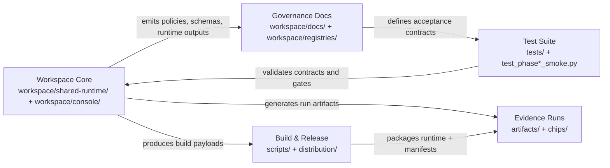
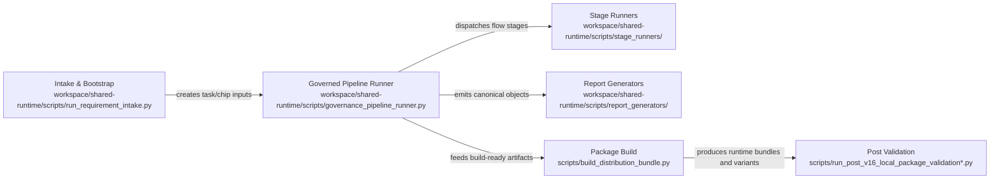
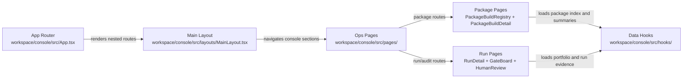
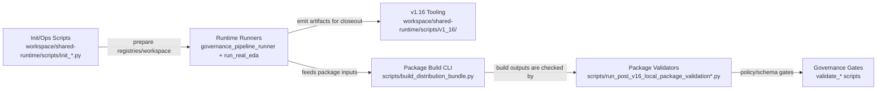
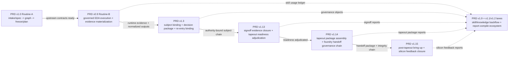

**The Governed Substrate for Agentic IC Design — A Constitution-First Verification Operating System.**

---

### Repo Bootstrap

- Start with [AGENTS.md](AGENTS.md), then read [workspace/skills/README.md](workspace/skills/README.md) before using any repo-local skill.
- `workspace/skills/` is the repo-local skill routing root, not a package inclusion root.
- Customer package inclusion must resolve through the registered skill pack manifests and distribution policy, not by scanning folders.

### 0. Latest Status (2026-05-23)

- 2026-05-23 governance alignment:
  - `Knowledge Asset Center` now exists as the derived read surface for run-local knowledge assets, while `Downstream Decision Control Tower` remains the human disposition surface for downstream gates.
  - `Downstream Decision Control Tower` now separates `EVIDENCE_READY` from human `Decision Status`, and its aggregate evidence preview is the reviewed entry for downstream gates.
  - `PRD v0.9` / Routine-B operator routing now explicitly states that downstream-related evidence files may materialize during middlestream execution, but downstream disposition still belongs in the control tower.
  - `flow_report_index` / Run Detail mainline now reflects `PRD v1.4` before `PRD v1.3` after inventory regeneration.
- 2026-05-19~2026-05-22 validation wave:
  - quad_uart, uart-controller-v0.1, async-fifo-v0.1, and test-chip-02 were revalidated through fresh governed run folders, with downstream source lanes, run-topology policy, and readiness closeout surfaces kept aligned.
  - progress/findings archive now carries the detailed step-by-step evidence for the 05/19~05/22 wave, while the README only retains the status truth that matters for current navigation.
  - the refreshed `06_console_introduction` screenshot set now includes the live downstream control tower capture instead of the stale loading-shell artifact.
- Agentic EDA trust calibration current status:
  - A1-A10 contract implementation is aligned across v1.1, v1.7/v1.8, v1.9, v1.13/v1.14, v1.16/v1.17, and QA evidence quality.
  - v1.9 skill validation now rejects invalid `execution_location` values and claim-bearing skill output without required verdict evidence.
  - v1.13/v1.14 now have machine-readable `ai_artifact_admission_record` schema surfaces with `AI_ARTIFACT_ADMISSION_*` verdicts.
  - v1.7/v1.8 now have Agent Trust Panel schema surfaces split between read-only visibility and live action binding/audit/replay.
  - v1.16/v1.17 compatibility notes preserve customer toolchain and package/runtime boundaries without creating PRD v1.18 or a parallel trust schema family.

- PRD v1.16 current status:
  - plugin on/off flow insertion-removal and artifacts run-folder reindex round-trip are implemented and validated (3-chip evidence path aligned).
- 2026-05-13 governance hardening delta:
  - signoff action routing moved from UI-only text to runtime artifact chain (`signoff_action_cli_templates`).
  - root cause closed on real execution path (report generator path output/mapping gaps), not on prefix/UI fallback.
  - `dashboard_objects` / `skill_usage` / `22_reports` are now run-level aligned and script-verifiable (`ALL_CHECKS_PASS` on 3 chips x ON/OFF).
- PRD v1.17 current status:
  - package build/release hard-law gates are implemented (`enterprise_site + source_overlay => BLOCKED`, source_escrow role separation), with machine-readable build index and console consumption path aligned.
- PRD v1.8 claim boundary:
  - `enterprise_site` live console baseline is in-scope; enterprise production certification is explicitly out-of-scope.
- PRD v1.17 implementation path is aligned and running with hard-law gates, negative policy tests, and closeout evidence:
  - `enterprise_site + source_overlay => BLOCKED`
  - `source_escrow` cannot be used as `package_variant` or `runtime_delivery_mode`
- PRD v1.17 package/runtime meaning matrix:

| runtime_delivery_mode (EN) 執行交付模式 (zh-TW) \ package_variant | solo_eval | team_project | enterprise_site | internal_validation |
| --- | --- | --- | --- | --- |
| `source_overlay` `源碼疊加` | ⚠️ internal/debug only; no customer release claim | ⚠️ internal integration only; no customer release claim | ⛔ `BLOCKED` (`ENTERPRISE_SITE_SOURCE_OVERLAY_FORBIDDEN`) | ✅ internal-only (`customer_release_claim=false`) |
| `pure_wheel_transitional` `過渡純 wheel` | ⚠️ transitional only | ⚠️ transitional only | ⚠️ allowed but should migrate to stricter modes | ⚠️ internal transitional validation |
| `compiled_wheel` `編譯 wheel` | ✅ default customer runtime mode | ✅ standard team mode | ✅ enterprise customer mode | ✅ allowed |
| `binary_lib` `二進位函式庫` | ⚠️ optional for higher sensitivity | ✅ recommended for higher sensitivity | ✅ recommended for higher sensitivity | ✅ allowed |
| `container_runtime` `容器執行期` | ⚠️ environment-dependent | ✅ operable team mode | ✅ operable enterprise mode | ✅ allowed |
| `managed_service` `託管服務` | ⚠️ deployment-model dependent | ✅ managed team mode | ✅ managed enterprise mode | ⚠️ usually not preferred |

Mode definitions (zh-TW):
- `source_overlay`（源碼疊加）：直接把 source tree 疊到執行環境跑。
- `pure_wheel_transitional`（過渡純 wheel）：用 wheel 安裝流程交付，但內容仍以 `.py` 為主。
- `compiled_wheel`（編譯 wheel）：主要是編譯後的模組（例如 `.so/.pyd`），不是直接可讀的核心 `.py`，同樣用 wheel 交付。
- Package build indexing is now machine-readable and console-consumable:
  - `artifacts/package-builds/package_build_index.json`
  - `workspace/portfolio/summaries/package-builds/package_build_index.json`
  - `workspace/portfolio/summaries/package-builds/customer_package_folders_index.json`
- Developer-only console page is available at:
  - `/package-builds?mode=<solo_eval|team_project|enterprise_site>&bundle=<bundle_id>&file=<variant_tar_gz>`
  - UI title: `Package Release Candidates` (`套件釋出候選`)
  - Interaction model: single bundle selector + left `.tar.gz` tree + right evidence/detail panes
  - Boundary: this page is internal-only and must not be included in customer package surfaces by default.

### 1. Repository Positioning

此倉庫是「內部治理 + 可部署交付線」的同位管理倉，不是單純客戶安裝包倉。
核心邊界如下：

1. [內部治理真值 (Workspace)](workspace/): 政策、PRD、closeout、共享 runtime source（不直接對客部署）。
2. [可部署交付邊界 (Product/Deployment)](product/): Runtime/policies/installers/profiles。
3. [交付產物 (Distribution)](distribution/): Pipeline 產出的 bundle/manifest/checksum/provenance（禁止手改）。
4. [生產紀律與治理閉環 (SOP)](workspace/docs/deployment/production_operations_sop_formalization_pack.v0.1.md): 生產紀律與治理閉環 Ops Line。

---

### 1.5 1st-Layer Mermaid Maps

完整索引與維護規則請見：
- [Architecture Mermaid Central Index](workspace/docs/governance/ops/architecture_mermaid_central_index.md)

#### overall-architecture

#### pipeline

#### route-page-map

#### command-surface

#### governed-full-flow-sequence (deep-dive)

#### silicon-lifecycle-mainline-expanded (deep-dive)

```mermaid
flowchart LR
    a10["PRD v1.0 Routine-A
inputs/spec -> inputs/graph
(route_a_openai_e2e_report.json, graph_freeze_record.json, graph_to_generation_plan.json)"]

    b01["v1_verilator_lint"] -->
    b02["v2_verilator_sim"] -->
    b03["v3_cdc_rdc"] -->
    b04["v3b_cdc_signoff_lite"] -->
    b05["v4_yosys_lec"] -->
    b06["h1_yosys"] -->
    b07["h2_openroad"] -->
    b08["h5_opensta"] -->
    b09["h4_klayout"] -->
    b10["h3_netgen"] -->
    b11["h9_power_ir_static"] -->
    b12["h10_power_ir_dynamic"] -->
    b13["h6_dft_scan"] -->
    b14["h7_esd_review"] -->
    b15["h8_io_pad_ring"]

    c13["PRD v1.3
subject_binding
(capability_contract_index, decision_package, silicon_contract, reentry_history)"]
    d113["PRD v1.13
signoff
(signoff_domain_matrix, signoff_evidence_manifest, signoff_gap_record, waiver/risk/owner chain, final_tapeout_readiness_record)"]
    e114["PRD v1.14
tapeout_package
(tapeout_package_manifest, package_integrity_manifest, handoff_authority/transfer/receipt, foundry_handoff_manifest)"]
    f115["PRD v1.15
silicon_feedback
(v115_sample/lab/bringup, v115_mismatch/errata/eco, v115_backflow, v115_post_tapeout_audit_bundle)"]

    a10 -->|"generation plan + frozen graph"| b01
    b15 -->|"execution chain outputs"| c13
    c13 -->|"subject contract bound"| d113
    d113 -->|"readiness adjudicated"| e114
    e114 -->|"handoff completed"| f115
```

---

### 2. v1.x PRD Canonical Entrypoints (Boundary-Safe)

1. [PRD v1.0 — Spec Completion & Architecture Graph Baseline for ic-agent-flow](workspace/docs/prd/PRD%20v1.0%20%E2%80%94%20Spec%20Completion%20%26%20Architecture%20Graph%20Baseline%20for%20ic-agent-flow.md): v1.0 唯一 canonical 主入口。
2. [PRD v1.1 — AAA-Inspired Knowledge Flywheel Baseline for ic-agent-flow](workspace/docs/prd/PRD%20v1.1%20%E2%80%94%20AAA-Inspired%20Knowledge%20Flywheel%20Baseline%20for%20ic-agent-flow.md): internal flywheel 與資產提升主責。
3. [PRD v1.2 — External Contribution, Adjudication, and Customer Update Propagation Baseline for ic-agent-flow](workspace/docs/prd/PRD%20v1.2%20%E2%80%94%20External%20Contribution%2C%20Adjudication%2C%20and%20Customer%20Update%20Propagation%20Baseline%20for%20ic-agent-flow.md): propagation/adoption taxonomy 上位真值。
4. [PRD v1.3 — Silicon Contract & Controlled Release Baseline](workspace/docs/prd/PRD%20v1.3%20%E2%80%94%20Silicon%20Contract%20%26%20Controlled%20Release%20Baseline.md): controlled release 與 silicon contract 主責。
5. [PRD v1.4 — QA Trust Layer Baseline for ic-agent-flow](workspace/docs/prd/PRD%20v1.4%20%E2%80%94%20QA%20Trust%20Layer%20Baseline%20for%20ic-agent-flow.md): anti-overclaim 與 evidence/scenario validation 真值。
6. [PRD v1.5 — Customer Site Bootstrap & Organization-Scale Operations Baseline](workspace/docs/prd/PRD%20v1.5%20Customer%20Site%20Bootstrap%20%26%20Organization-Scale%20Operations%20Baseline.md): customer site activation 與 organization operations 主責。
7. [PRD v1.6 — Product IP Protection & Controlled Distribution Baseline](workspace/docs/prd/PRD%20v1.6%20%E2%80%94%20Product%20IP%20Protection%20%26%20Controlled%20Distribution%20Baseline.md): product IP protection、controlled distribution、source exclusion、entitlement、vendor IP leak scan 與 trust-balanced package 主責。
8. [PRD v1.7 — Dashboard Baseline](workspace/docs/governance/closeout/v1.7/v1.7_closeout_report.md): static Flow Control Tower baseline（`PASS_WITH_WARNINGS`）真值入口。
9. [PRD v1.8 — Live Console Hardening Baseline](workspace/docs/governance/closeout/v1.8/v1.8_closeout_report.md): live console hardening baseline（`PASS_WITH_WARNINGS`）真值入口。
10. [PRD v1.9 — Pre-Implementation Canonicalization Pack](workspace/docs/prd/PRD%20v1.9%20%E2%80%94%20Pre-Implementation%20Canonicalization%20Pack.md): governed skill pack canonical baseline（`APPROVED_CANONICAL`）主入口。
11. [PRD v1.10 — Release Reference Asset Catalog Closeout](workspace/docs/governance/closeout/v1.10/README.md): reference asset catalog baseline（`APPROVED`）真值入口。
12. [PRD v1.12 — Governed Vibe-Level Silicon Flow Baseline](workspace/docs/prd/PRD%20v1.12%20%E2%80%94%20Governed%20Vibe-Level%20Silicon%20Flow%20Baseline.md): architecture exploration / governed vibe-level baseline（已完成 baseline 對齊，後續優化走 non-blocking optimization lane）。
13. [PRD v1.13 — Signoff Evidence Closure & Tapeout Readiness Baseline](workspace/docs/prd/PRD%20v1.13%20%E2%80%94%20Signoff%20Evidence%20Closure%20%26%20Tapeout%20Readiness%20Baseline.md): signoff domain closure、waiver/risk/owner chain、tapeout readiness adjudication baseline。
14. [PRD v1.14 — Tapeout Package Assembly & Foundry Handoff Baseline](workspace/docs/prd/PRD%20v1.14%20%E2%80%94%20Tapeout%20Package%20Assembly%20%26%20Foundry%20Handoff%20Baseline.md): package assembly、integrity、handoff authority/transfer/receipt baseline。
15. [PRD v1.15 — Post-Tapeout Bring-up & Silicon Feedback Baseline](workspace/docs/prd/PRD%20v1.15%20%E2%80%94%20Post-Tapeout%20Bring-up%20%26%20Silicon%20Feedback%20Baseline.md): bring-up mismatch/errata/ECO/backflow/audit baseline。
16. [PRD v1.16 — Customer Toolchain Plug-in & Governed Node Replacement Baseline](workspace/docs/prd/PRD%20v1.16%20%E2%80%94%20Customer%20Toolchain%20Plug-in%20%26%20Governed%20Node%20Replacement%20Baseline.md): customer EDA tool plug-in/plug-out governance、node replacement boundary、artifacts run-folder reindex contract baseline。
17. [PRD v1.17 — Package Build, Runtime Distribution Mode & Release Execution Baseline](workspace/docs/prd/PRD%20v1.17%20%E2%80%94%20Package%20Build%2C%20Runtime%20Distribution%20Mode%20%26%20Release%20Execution%20Baseline.md): package variant/runtime/source-disclosure/artifact-class governance、hard-law build gates、release index and evidence contract baseline。
18. MCU dashboard reference extraction addenda (2026-05-13): v1.9/v1.12/v1.13/v1.16 新增 stage-level cockpit、conditional pass、black-box limitation、commercial-tool portability 與 No-Proof-No-Claim 對齊規則。

`PRD v1.0-addendum` 與 `Approve-Ready Revision Spec — PRD v1.0 ...` 保留作為歷史來源/批准脈絡，不是 canonical entrypoint。

#### Lifecycle vs Lanes (v1.11/v1.12 Position Clarification)

- Main Silicon Lifecycle (hard gate): `v1.0 -> v0.9 -> v1.3 -> v1.13 -> v1.14 -> v1.15`
- Cross-cutting / extension lanes (non-blocking): `v1.9 -> v1.1/v1.2`, `v1.11 (NON_SIGNOFF_CDC_LITE)`, `v1.12 (Governed Vibe-Level; Track B optional extension lane)`
- Governance law: lanes can enrich evidence/operations, but cannot reorder or replace the hard-gate lifecycle.

#### Report Family Path Canonicalization (2026-05-08)

Production-run formal reports are canonicalized at:

- `artifacts/production-runs/<chip_id>/<run_id>/<execution>/22_reports/`

Run structure contract:

- `22_reports/` is the canonical report-family path (Window C closed).
- `21_dashboard_objects/` remains a derived dashboard-object family (non-report objects).

Run-level report registry:

- `flow_report_index.json`
- `flow_report_index.md`

Normative contract:

- `workspace/docs/prd/Readiness Report Family Alignment Addendum.md`

v1.0 rollout closeout 與 Appendix B reference coverage 現況請見：
- [PRD v1.0 Implementation Closeout (v0.1)](workspace/docs/governance/closeout/v1.0/prd-v1-0-implementation-closeout.v0.1.md)

---

### 3. System Capabilities

1. **[Capability Baseline](workspace/docs/management/ic-agent-flow-v0.9-Governed-Open-Source-EDA-Scenario-Baseline.md)**: Governed Open-Source EDA execution chain (H1→H2→H4→H3) with artifact lineage.
2. **部署打包線**: 輸出 `runtime-bundle`、manifest、checksum、provenance。
3. **部署治理驗收**: P1-P6 gates、FDP-01 acceptance、cutover/support evidence。
4. **交付入口**: bundle 內含 installer 與 healthcheck，支援安裝後驗證。
5. **Release 真值追溯**: `release_record` + `deployment_release_note` + closeout audit chain。
6. **站點資格審查 (Site Qualification)**: [site_qualification_model.md](workspace/docs/deployment/site_qualification_model.md)，透過 `EnvironmentFingerprint` 進行生產環境准入管理。

---

### 4. Operator Entry

1. 建置與驗證交付：
   - `npm run build-distribution`
   - `npm run validate-distribution`
2. 執行部署驗收與 first release：
   - `npm run run-fdp01`
   - `npm run run-first-release`
3. 安裝與健康檢查請走以下對客文件：
   - [deployment_operation_guide.v0.1.md](workspace/docs/deployment/deployment_operation_guide.v0.1.md)
   - [deployment_release_notes/](workspace/docs/management/deployment_release_notes/)
   - bundle 內：`deployment/installers/install_runtime_bundle.py` / `deployment/installers/healthcheck_runtime_install.py`
4. 站點資格審查與工具鏈相容性：
   - [site_qualification_model.md](workspace/docs/deployment/site_qualification_model.md)
   - [customer-local-real-eda-rerun-and-readiness-guide.v0.1.md](workspace/docs/deployment/customer-local-real-eda-rerun-and-readiness-guide.v0.1.md)
   - [toolchain-portability-profile-resolution-contract.v0.1.md](workspace/docs/deployment/toolchain-portability-profile-resolution-contract.v0.1.md)
   - customer-facing rerun wrapper:
     - `./.venv/bin/python deployment/installers/run_customer_local_readiness.py --deployment-profile <profile> --chip-id <chip_id> --task-id <task_id> --rtl-src <rtl_path> --chip-name <name> --rtl-function <function>`
   - release-bound governed runtime entrypoint:
     - `./.venv/bin/python deployment/installers/run_governed_readiness_entry.py '<json-payload>'`
   - deployment runtime substrate:
     - `deployment/runtime/governance_pipeline_runner.py`
   - canonical internal governed source:
     - `workspace/shared-runtime/scripts/governance_pipeline_runner.py`
5. 生產紀律與 Ops 規訓：
   - [production_operations_sop_formalization_pack.v0.1.md](workspace/docs/deployment/production_operations_sop_formalization_pack.v0.1.md)

### 5. Graph Companion Rendering (Dev/Review Dependency)

為了把 `*.dot` companion view 渲染成可讀的 `*.png`，開發機建議安裝 Graphviz：

- 安裝（macOS/Homebrew）：`brew install graphviz`
- 驗證：`dot -V`

此依賴屬於 **開發/審查工具**，不是 runtime hard dependency。
canonical truth 仍是 JSON object；`.dot` / `.png` 都是 review-assist companions。

批次渲染命令：

- `npm run render-graph-companions`
- 或 `python3 workspace/shared-runtime/scripts/render_graphviz_companions.py --force`

---

### 6. Current Real EDA Snapshot

目前 repo 的真實 EDA 執行線已包含：

- `V1` Verilator lint
- `V2` bounded Verilator simulation
- `V3` CDC/RDC structural analysis normalization
- `V4` Yosys LEC (`equiv_simple`)
- `H1` Yosys synthesis
- `H2` OpenROAD execution
- `H5` OpenSTA timing analysis
- `H4` KLayout bounded DRC / realized GDS
- `H3` Netgen LVS
- `H9` bounded static IR-drop
- `H10` bounded dynamic IR-drop
- `H6` DFT scan evidence lane
- `H7` ESD review evidence lane
- `H8` IO pad ring evidence lane

v1.0 closeout rerun（historical）：

- `test-chip-02` → `20260422-152501` (`T-SN2025-V10-CLOSEOUT-R2`)
- `uart-controller-v0.1` → `20260422-152524` (`T-UART-V10-CLOSEOUT-R2`)

post-v1.9 三晶片 REAL rerun（2026-05-01）：

- `test-chip-02` → `20260501-114526` (`T-SN2025-01`)
- `uart-controller-v0.1` → `20260501-114549` (`T-UART-001`)
- `async-fifo-v0.1` → `20260501-114625` (`T-FIFO-001`)

power/production cleanup rerun（2026-05-03）：

- `test-chip-02` → `20260503-011236` (`T-SN2025-01`)
- `uart-controller-v0.1` → `20260503-011316` (`T-UART-001`)
- `async-fifo-v0.1` → `20260503-011401` (`T-FIFO-001`)

verification-depth gate-hardening rerun（2026-05-06）：

- `test-chip-02` → `20260506-145852` (`T-SN2025-01`; `🟢32 🟡0 🔴0 ⚪3`)
- `uart-controller-v0.1` → `20260506-145909` (`T-UART-001`; `🟢32 🟡0 🔴0 ⚪3`)
- `async-fifo-v0.1` → `20260506-145932` (`T-FIFO-001`; `🟢32 🟡0 🔴0 ⚪3`)

enterprise-certification PASS adjudication rerun（2026-05-06）：

- `test-chip-02` → `20260506-151857` (`T-SN2025-01`; `🟢33 🟡0 🔴0 ⚪3`)
- `uart-controller-v0.1` → `20260506-151918` (`T-UART-001`; `🟢33 🟡0 🔴0 ⚪3`)
- `async-fifo-v0.1` → `20260506-151950` (`T-FIFO-001`; `🟢33 🟡0 🔴0 ⚪3`)

當前 current truth（latest）：

- `test-chip-02` = `🟢 READY for digital-only bounded scenario closeout`（`20260506-211858`; `🟢35 🟡0 🔴0 ⚪3`）
- `uart-controller-v0.1` = `🟢 READY for digital-only bounded scenario closeout`（`20260506-211919`; `🟢35 🟡0 🔴0 ⚪3`）
- `async-fifo-v0.1` = `🟢 READY for digital-only bounded scenario closeout`（`20260506-211945`; `🟢35 🟡0 🔴0 ⚪3`）

最新 v1.0 對齊 + full-mainline skill ledger rerun（2026-05-06）：

- `test-chip-02` → `20260506-122133` (`T-SN2025-01`)
- `uart-controller-v0.1` → `20260506-122229` (`T-UART-001`)
- `async-fifo-v0.1` → `20260506-122312` (`T-FIFO-001`)

2026-05-06 狀態補充（治理規則已升級並完成 reconvergence）：
- `20_skill_usage` 已擴充為 full-mainline + lane ledger（mainline: `v1.0 -> v0.9 -> v1.3 -> v1.13 -> v1.14 -> v1.15`; lanes: `v1.9 -> v1.1/v1.2`），三顆 run 已落地對應 evidence path。
- `DFT / ESD / I/O pad` readiness gate 已由 bounded-proxy auto-green 改為 signoff-depth evidence gate（需 coverage/ATPG、ESD signoff、IO pad connectivity/package 類證據才可 `DONE`）。
- gate 升級後已完成三顆 rerun（`143543/143600/143623`），並且在 `h6/h7/h8` stage 產生 `external_signoff_manifest.json`；其後歷經 `1458xx -> 1518xx -> 2118xx` 連續收斂，當前 totals 為 `🟢35 🟡0 🔴0 ⚪3`。
- bounded smoke simulation 的語義仍應維持在 smoke-level evidence，而不是 full functional signoff。
- `Vx/Hx` 全鏈已建立 Signoff-Depth Gate Matrix（節點欄位、artifact 路徑、PASS/FAIL 規則）：
  - `workspace/docs/governance/ops/vx_hx_signoff_depth_gate_matrix.v0.1.md`
  - 目的：防止 bounded proxy 誤宣稱為 production signoff（No-Proof-No-Claim）。

2026-04-21 增量（deeper yellow backlog）：
- `Formal verification`：三顆已從 `NOT CHECKED` 推進為 `PARTIAL (assertions=1)`。
- `Coverage`：三顆已由 Verilator LCOV 產生 bounded PASS；branch coverage 仍為 advisory。
- `LEC / Equivalence check`：三顆已由既有 Yosys `equiv_simple` 產生 `v4_yosys_lec` evidence 並轉為 `PASS`。
- `Spec review`、`Power domain consistency`、`Risk commentary`、`Bringup plan`：已改為 artifact-backed green row；其中 bringup 只代表 plan documentation，不代表 lab execution。
- `Timing exception review` / `RDC`：SN2025、UART 已轉綠；Async FIFO 因 multi-clock/multi-reset 保持 `PARTIAL`。
- `DFT / ESD / pad`：報告已出現 runtime 文件探針（`dft_docs/esd_docs/pad_docs`），但沒有 scan insertion 或實體 pad/ESD integration，因此仍保留黃燈。

歷史參考（2026-04-21 no-new-tool yellow cleanup）：
- `test-chip-02` → `20260421-134738`，summary `🟢24 🟡7 🔴0 ⚪3`
- `uart-controller-v0.1` → `20260421-134805`，summary `🟢24 🟡7 🔴0 ⚪3`
- `async-fifo-v0.1` → `20260421-134805`，summary `🟢21 🟡10 🔴0 ⚪3`

### 7. PRD v1.0 ~ v1.6 + Route B Rollout Snapshot (2026-04-26)

- 狀態：`Phase 0–6 IMPLEMENTATION_COMPLETE_CLOSEOUT_READY`（已 merge/push 到 `main`）
- 兩顆 closeout rerun（release-bound）：
  - `test-chip-02` → `artifacts/production-runs/test-chip-02/T-SN2025-V10-CLOSEOUT-R2/20260422-152501`
  - `uart-controller-v0.1` → `artifacts/production-runs/uart-controller-v0.1/T-UART-V10-CLOSEOUT-R2/20260422-152524`
- `inputs/spec|graph|design` + derived fail-closed downstream gate 已在 shared/deployment runtime 對齊。
- Appendix B reference coverage 現況：`5 COVERED / 2 DOC_ONLY / 2 FULL_IMPL`（OpenAI Agent SDK graph-builder Route A 已完成 workflow productization）。
- Route B capability-extension line：`B5 COMPLETE_AND_ALIGNED`（B0→B5 歷史 closeout 決策維持；Route A builder runtime integration 已於 2026-04-23 完成 `FULL_IMPL`，且 residual closure matrix 已納入治理對齊）。
- PRD v1.1 knowledge flywheel implementation line：`IMPLEMENTATION_COMPLETE`（Phase 0~7 完成；全組 v1.1 驗證 `25 passed`）。
- v1.1 closeout refs：
  - `workspace/docs/governance/closeout/v1.1/prd-v1-1-implementation-closeout.v0.2.md`
  - `workspace/docs/governance/closeout/v1.1/prd-v1-1-evidence-index.v0.2.md`
- PRD v1.2 ecosystem boundary/propagation implementation line：`IMPLEMENTATION_COMPLETE`（Phase 0~7 完成；全組 v1.2 驗證 `31 passed`）。
- v1.2 closeout refs：
  - `workspace/docs/governance/closeout/v1.2/prd-v1-2-implementation-closeout.v0.2.md`
  - `workspace/docs/governance/closeout/v1.2/prd-v1-2-evidence-index.v0.2.md`
- PRD v1.3 Silicon Contract implementation line: `IMPLEMENTATION_COMPLETE`（Phase 1~6 完成；全組 v1.3 驗證 `45 passed`）。
- v1.3 closeout refs：
  - `workspace/docs/governance/closeout/v1.3/prd-v1-3-implementation-closeout.v0.1.md`
  - `workspace/docs/governance/closeout/v1.3/prd-v1-3-evidence-index.v0.1.md`
- PRD v1.4 QA Trust Layer implementation line: `IMPLEMENTATION_COMPLETE`（Phase 0~6 完成；全組 v1.4 驗證 `18 passed`，Fail-Closed QA Gate 已綁定）。
- v1.4 closeout refs：
  - `workspace/docs/governance/closeout/v1.4/prd-v1-4-implementation-closeout.v0.1.md`
  - `workspace/docs/governance/closeout/v1.4/prd-v1-4-evidence-index.v0.1.md`
- **PRD v1.6 Product IP Protection & Controlled Distribution**: `FULL_IMPL`（IP classification、controlled distribution、source exclusion、entitlement、vendor IP leak scan、support dual-redaction、source escrow exception 與 closeout scenario A-E 已落地）。
- **Post-v1.6 strict local package validation**: `APPROVE`（closeout `20260426115036`；`No-Proof-No-Claim / Gap Matrix / Phase6 Overlay / Dual-Run-Parity` 全 PASS；package/repo readiness summary 對齊 `22/9/0/3`, `71.0%`）。
- **Risk Mitigation v0.1 R1/R2/R4 Alignment**: `R1_L3_COMPLETE + R2_V1_5_CUSTOMER_READY_ALLOWED + R4_V1_6_IP_SAFE_DISTRIBUTION_ALLOWED`（5/5 canonical claims ALLOWED）。
- R1 evidence refs：
  - `workspace/docs/reviews/risk-mitigation-implementation-plan-v0.1.md`
  - `workspace/docs/governance/closeout/risk_mitigation_v0.1/runtime_proof_matrix.md`
  - `workspace/docs/governance/closeout/risk_mitigation_v0.1/no_proof_no_claim_report.md`
- Coverage current-truth reference: [Runtime Mainline Coverage Registry v0.1](workspace/docs/governance/ops/Runtime%20Mainline%20Coverage%20Registry%20v0.1.md)

### 7.1 Customer Release Packaging Alignment (2026-04-29)

- `solo_eval` / `team_project` / `enterprise_site` 已落地為三個獨立 customer package artifact（不再單包混裝）。
- customer release staging 已固定單一搬運根目錄：`artifacts/customer-release-staging/<bundle_id>/`，可一次拷貝到 `ic-agent-flow-customer-releases`。
- `<bundle_id>` 命名已改為 `runtime-bundle-tw-YYYYMMDDHHMMSS`（`Asia/Taipei`, UTC+8）。
- 每個 variant staging 目錄均提供 pre-extract docs（`README.md` + `deployment/docs/*`），讓 AI/Human 在解壓前可先判斷適配性與操作路徑。
- package 內新增 customer-facing runtime contract：`runtime/package_capabilities/runtime_environment_manifest.json`，避免要求客戶依賴 repo root 開發檔推導 runtime 需求。

### 7.2 PRD v1.7 Dashboard Baseline Alignment (2026-04-30)

- PRD v1.7 closeout verdict: `PASS_WITH_WARNINGS`（static Flow Control Tower baseline approved）。
- Allowed claims：
  - dashboard object contracts schema-valid
  - static dashboard MVP required pages generated
  - Playwright browser validation pass
  - package-extract-safe relative artifact path display
- Forbidden claims：
  - live multi-user console readiness
  - enterprise operational readiness
  - dashboard replacing PRD truth source
- Future hardening backlog 已建立：`workspace/docs/governance/closeout/v1.7/v1.7_future_hardening_backlog.md`
- Console 現況補充：
  - `/console` 支援 profile-aware home（dev 可切 `solo_eval/team_project/enterprise_site`；release profile lock）。
  - `Mode Focus` cards 已改為 evidence-driven gate/blocker signals（由 dashboard objects 載入；非頁面寫死示意值）。

### 7.3 PRD v1.8 Live Console Hardening Baseline Alignment (2026-05-01)

- PRD v1.8 closeout verdict: `PASS_WITH_WARNINGS`（live console hardening baseline approved with explicit claim boundary）。
- Phase 1~8 implementation completed:
  - schema/object contracts
  - flow registry builder
  - node IO manifest producer
  - artifact URI/path resolver
  - package readiness panel
  - decision inbox
  - static dashboard MVP (v1.8 baseline)
  - UI/UX Max Pro review gate + closeout scenarios
- Closeout evidence:
  - `workspace/docs/governance/closeout/v1.8/v1.8_closeout_report.md`
  - `workspace/docs/governance/closeout/v1.8/v1.8_acceptance_matrix.md`
  - `workspace/docs/governance/closeout/v1.8/v1.8_test_mapping.md`
- Playwright validation (v1.7 + v1.8 static dashboard):
  - `cd workspace/console && npx playwright test --config playwright.static.config.ts`
  - result: `12 passed`

### 7.4 Post-v1.9 3-Chip Skill Boot Validation (2026-05-01)

- Post-v1.9 closeout verdict: `PASS_WITH_WARNINGS`（REAL run 完成，claim boundary 維持）。
- REAL run scope：`SN2025/UART/ASYNC_FIFO`，deployment profile=`airgap-local`。
- 三顆皆完成 governed full chain：`V1/V2/V3/V4 + H1/H2/H4/H3`。
- readiness compiler gates：三顆皆 `G1~G9 PASS`。

### 7.5 v0.2 Hierarchical + Pre-Spec Closeout (2026-05-06)

- 狀態：`PASS / COMPLETE`
- canonical spec（ACTIVE）：
  - `workspace/docs/reviews/2026-05-06 Hierarchical Flow + Pre-Spec Estimation 實作規格 .md`
- implementation closeout：
  - `workspace/docs/governance/closeout/v0.2/v0.2_2026-05-06_hierarchical_flow_pre_spec_estimation_implementation_closeout.md`
- 最新三顆 rerun（closeout evidence）：
  - `test-chip-02` → `T-SN2025-01/20260506-211858`
  - `uart-controller-v0.1` → `T-UART-001/20260506-211919`
  - `async-fifo-v0.1` → `T-FIFO-001/20260506-211945`
- 三顆一致結果：
  - `v1_0_alignment_assessment.overall_status = GREEN`
  - `readiness_report_action_items.total_count = 0`
  - `readiness totals = 🟢35 🟡0 🔴0 ⚪3`
- closeout refs：
  - `workspace/docs/governance/closeout/post-v1.9-3chip/post_v19_3chip_real_run_closeout_summary.md`
  - `workspace/docs/governance/closeout/post-v1.9-3chip/post_v19_3chip_single_page_scorecard.md`
  - `workspace/docs/governance/closeout/post-v1.9-3chip/cross_chip_skills_used_detailed_report.md`

### 7.6 PRD v1.9 Canonical Baseline (2026-05-01)

- PRD v1.9 canonicalization pack status: `APPROVED_CANONICAL`
- In-scope baseline: governed execution skill + decision-tree routing skill + bounded fallback + QA-trust-bound claim boundary
- canonical refs：
  - `workspace/docs/prd/PRD v1.9 — Governed IC Design Skill Pack & Reusable Front-End Capability Baseline.md`
  - `workspace/docs/prd/PRD v1.9 — Pre-Implementation Canonicalization Pack.md`

### 7.7 Incremental Window Alignment (2026-05-02 ~ 2026-05-03)

- `2026-05-02`: PRD v1.11 `Open-Source CDC Signoff-Lite (Non-Signoff)` lane implemented
  - `v3b_cdc_signoff_lite` with `sby + z3` validated on three chips
  - claim class bounded to `NON_SIGNOFF_CDC_LITE`
- `2026-05-02`: v1.8 console deep-dive semantic hardening addenda accumulated
  - artifact-semantic checks, authority-plane evidence-driven migration, context-preserving selector parity
- `2026-05-03`: power/prod cleanup rerun
  - `Static IR-drop` / `Dynamic IR-drop` moved to `DONE` on all three chips
  - remaining yellow/action items converge to `DFT/Scan`, `ESD`, `I/O pad`

最新 rerun 也已把 execution-environment truth 顯式帶進 report surface：

- 每個 governed run 都有 `toolchain_resolution/normalized_toolchain_resolution_record.json`
- 每個 governed run 都有 `toolchain_resolution/environment_fingerprint.json`

### 7.8 PRD v1.10 Release Reference Asset Catalog Baseline (2026-05-01)

- PRD v1.10 closeout status: `APPROVED`
- baseline verdict: `PASS`
- scope:
  - catalog-governed package/reference asset resolution
  - M0/M1/M2 migration complete (`catalog-only` enforced)
  - AC1~AC31 mapping file materialized
- closeout refs：
  - `workspace/docs/governance/closeout/v1.10/README.md`
  - `workspace/docs/governance/closeout/v1.10/v1.10_closeout_summary.md`
  - `workspace/docs/governance/closeout/v1.10/v1.10_ac1_ac31_mapping.md`
- `readiness_report_manifest.v0.2.json` 與 `readiness_report_generation_log.v0.2.json` 會顯式引用上述 environment provenance artifact
- `deployment/runtime/...` 已完成 first-wave materialization，並通過一次無 `workspace/` package root acceptance run：
  - packaged acceptance roots: `/tmp/icaf-packaged-accept` and `/tmp/icaf-packaged-accept-phase1`
  - acceptance runs:
    - `test-chip-02` → `20260418-061831`
    - `uart-controller-v0.1` → `20260418-111918`
    - `async-fifo-v0.1` → `20260418-111918`
  - result for all three:
    - `🟡 CONDITIONALLY READY`
    - `RTL simulation = 🟢 PASS`
    - `DRC (KLayout) = 🟢 PASS`
    - `GDS generation = 🟢 DONE`

---

## 8. Current Operating Boundary Model

### IC-Facing Console Terminology Overlay

The console now uses an IC design terminology overlay for human-facing labels while keeping backend object names, route keys, schemas, and persisted governance records unchanged. The overlay is display-only: `governance boundary` is shown to operators as `Sign-off Boundary`, `Artifact Browser` is shown as `Sign-off Evidence Vault`, `Decision Inbox` as `Sign-off Action Queue`, and `Package Readiness` as `Release Package Readiness`. The overlay also defines IC-domain vocabulary for STA/timing closure, CDC/RDC, DFT, low-power/UPF, physical verification, ECO, waiver handling, and evidence/readiness claim boundaries.

Reference: [IC Design Console Terminology Overlay v0.1](workspace/docs/governance/terminology/ic_design_console_terminology_overlay_v0.1.md).

### World A: Internal Governed Substrate
- `workspace/`: governance truth, PRD, closeout, shared runtime source（不直接對客部署）
- `templates/`: versioned blueprint / initialization DNA
- `chips/`: chip-scoped upstream truth workspace (`CHIP_UPSTREAM`) for Requirement Intake Session, Requirement Adjudication, Upstream Truth Flow, freeze candidates, and generation planning

### Upstream Console Page Boundary

Current console upstream surfaces are intentionally separated from run evidence:

| Console Surface | Scope | Source | Meaning |
| --- | --- | --- | --- |
| `Spec Intake & Architecture Kickoff` | `CHIP_UPSTREAM` | `chips/<chip_id>/specs/intake/<session>/` plus template resolution metadata | restores or materializes intake session truth, template resolution, next-step guidance, and the upstream board |
| `Requirement Sign-off Gate` | `CHIP_UPSTREAM` | `chips/<chip_id>/specs/...` and `chips/<chip_id>/architecture/builder_validation_handoff.json` | lets human authority write `requirement_item_adjudication_record.json` and updates review/handoff status |
| `Spec-to-Architecture Closure Flow` | `CHIP_UPSTREAM` | `chips/<chip_id>/...` | dedicated PRD v1.0 continuation surface for real `architecture_graph.json` generation/refinement, Graph Validation, Freeze, Generation Plan, and bounded RTL candidate preparation before PRD v0.9 |
| `EDA Run Closure Detail` | `RUN_EXECUTION` | `artifacts/production-runs/...` | formal runner evidence only after execution exists |

`Write Adjudication Record` does **not** create `run_id`, `artifacts/production-runs/...`, real `architecture_graph.json`, Graph Validation, Freeze, or Generation Plan artifacts. It writes the adjudication decision and advances the builder handoff at most to `PENDING_VALIDATION`; `Open Spec-to-Architecture Closure Flow` is the correct continuation action.

`architecture_graph.draft.json` is only an intake scaffold. The real graph candidate is `chips/<chip_id>/architecture/architecture_graph.json`, generated or refined after requirement/spec adjudication by a bounded local AI/OpenAI graph builder. RTL generation is the next missing bridge before PRD v0.9 when no approved RTL is supplied: bounded RTL candidates belong under `chips/<chip_id>/rtl/` with `rtl_generation_request.json` and `rtl_generation_record.json`. PRD v0.9 runner execution later snapshots `chips/<chip_id>/specs`, `architecture`, `architecture/validation`, `governance/freeze`, `generation`, and `rtl` outputs into run-local `inputs/spec`, `inputs/graph`, and `inputs/design/rtl`; after dynamic sequence prefixing this may appear physically as `01_inputs/...` in `artifacts/production-runs`.

Folder-level package notes:

- [`chips/README.md`](chips/README.md): chip workspace structure and file meaning.
- [`templates/README.md`](templates/README.md): reusable template blueprint structure and file meaning.

### World B: Customer Deployable Delivery Line
- `product/`: deployable product source boundary
- `deployment/`: profile / installer / upgrade / rollback boundary
- `distribution/`: pipeline-generated deliverables（禁止手改）

Boundary laws are aligned with:
- [site_qualification_model.md](workspace/docs/deployment/site_qualification_model.md)
- [revision_spec_customer_deployment_packaging_model.v0.2.md](workspace/docs/governance/ops/revision_spec_customer_deployment_packaging_model.v0.2.md)
- [project_status_snapshot.md](workspace/docs/governance/ops/project_status_snapshot.md)

---

## 9. Release History (Track-Aligned)

- [release_history_track_aligned.md](workspace/docs/management/release_history_track_aligned.md)

---
**Current Capability Baseline**: `v0.9 runtime scenario + v1.0 upstream governance rollout + v1.1/v1.2 closeout + v1.3/v1.4 trust/contract boundary + v1.7/v1.8 flow/live console + v1.9/v1.10 governed skill/reference catalog + v1.13/v1.14/v1.15 signoff/tapeout/silicon lanes + v1.16/v1.17 toolchain/package lanes`
**Current Runtime Addendum Baseline**: `EDA Execution Gateway & Stateful Tool Session v0.1 (Implemented + CI-Verified)`
**Current Deployment Baseline**: `v0.2 deployment packaging line (FDP-01 PASS)`
**Current Ops Revision Baseline**: `Customer Site Qualification & Toolchain Compatibility Ops Line v0.1 (CLOSED)`
**Current Customer Readiness Baseline**: `PRD v1.5 customer site bootstrap baseline (Implemented + Closeout Published)`
**Current Product IP Distribution Baseline**: `PRD v1.6 product IP protection + controlled distribution baseline (FULL_IMPL closeout published)`
**Current Dashboard Baseline**: `PRD v1.7 static Flow Control Tower + Downstream Decision Control Tower + Knowledge Asset Center (derived-only; evidence-ready split from human decision status)`
**Current Live Console Baseline**: `PRD v1.8 Live Console Hardening & Human Authority Operation baseline (PASS_WITH_WARNINGS; static baseline + closeout scenarios + Playwright validated; formal decision read/write-back and audit replay aligned)`
**Current Decision / Knowledge Surface Baseline**: `Downstream Decision Control Tower + Knowledge Asset Center are live; downstream evidence is review input, not human approval, and knowledge backflow follows v1.1/v1.2 governance routing`
**Current Console Terminology Baseline**: `IC Design Console Terminology Overlay v0.1 is display-only; route keys/backend schemas/governance records remain unchanged`
**Current Upstream Console Baseline**: `Spec Intake & Architecture Kickoff + Requirement Sign-off Gate + Spec-to-Architecture Closure Flow aligned as CHIP_UPSTREAM surfaces; EDA Run Closure Detail remains RUN_EXECUTION only`
**Current Execution Console Data Baseline**: `Layered inventory split preserved (L1/L2 for selectors) with L3 lazy hydration for deep evidence content on flow-map/node-io/run-detail/signoff/tapeout-package/silicon-feedback (2026-05-20 fix landed); downstream control tower preview now groups all gates and defaults collapsed`
**Current Signoff/Tapeout/Silicon Baseline**: `PRD v1.4 QA trust -> PRD v1.3 silicon contract -> PRD v1.13/v1.14/v1.15 baseline implemented and governed`
**Current Review Closeout Baseline**: `2026-05-09 four-review closeout index published; OPEN/PARTIAL/RETEST_REQUIRED residuals = NONE`
**Current OI Closure Baseline**: `OI-001/OI-002 closed with machine-checkable gates`
**Current Log Governance Baseline**: `progress.md/findings.md header integrity gate active`
**Current Risk Mitigation Baseline**: `Risk Mitigation v0.1 R1 L3 Complete + R2 v1.5 Aligned + R4 v1.6 Aligned; No-Proof-No-Claim Gate Active (5/5 claims allowed)`
**Current Post-v1.6 Validation Baseline**: `Strict local package validation APPROVE (20260426115036); package/repo readiness summary parity aligned`
**Status Snapshot**: [project_status_snapshot.md](workspace/docs/governance/ops/project_status_snapshot.md)

### Residual Gaps Snapshot

| Metric | Count | Notes |
| --- | ---: | --- |
| Active Residual Gaps (Open) | 0 | none |
| Open by Area | 0 bucket | none |
| Recently Closed Residual Gaps | 11 | includes v1.8 (`RG-V18-001/002/003/004`), v1.1, v1.2, Route B residual contractization, `RG-OPS-001`, `RG-V09-002`, `RG-V09-001` |
| Explicit Claim Boundaries | 3 | `CB-001`~`CB-003` |

Canonical source:
- [residual_gaps_register.md](workspace/docs/governance/ops/residual_gaps_register.md)
- [2026-05-09-review-closeout-index.md](workspace/docs/governance/closeout/2026-05-09-review-closeout-index.md)
- [validate_progress_findings_headers.py](workspace/shared-runtime/scripts/validate_progress_findings_headers.py)
